# Cloud Native Workshop
## Table of contents
1. [Introduction](#introduction)
2. [Installation](#installation)
3. [Basic commands](#basic-commands)
4. [How to build your first container](#how-to-build-your-first-container)
5. [Multi-container Docker applications](#multi-container-docker-applications)
6. [Additional tooltips and practices that do not match the rest of the guide](#additional-tooltips-and-practices-that-do-not-match-the-rest-of-the-guide)

## Introduction

Welcome to the first Cloud Native Workshop labs!  
You will learn the basic docker commands, how to prepare, build and run your first container and how to use docker-compose to run a group of containers.

## Installation  

Depending on what system you use, the docker installation may be different, the easiest way is to always follow the instructions provided in the Docker documentation:
- [Windows](https://docs.docker.com/desktop/windows/install/)
- [Mac](https://docs.docker.com/desktop/mac/install/)
- GNU/Linux:
    - [Debian](https://docs.docker.com/engine/install/ubuntu/)
    - [Ubuntu](https://docs.docker.com/engine/install/debian/)
    - [Centos](https://docs.docker.com/engine/install/centos/)
    - [Fedora](https://docs.docker.com/engine/install/fedora/)

If you have a GNU/Linux system, you can also consider performing additional optional configuration thanks to which, among other things, you will be able to execute commands without the need to elevate privileges ▶ [Post-installation steps for Linux](https://docs.docker.com/engine/install/linux-postinstall/)

After installing and launching the Docker application, let's run our first command to check the Docker version:
```
$ docker --version
```
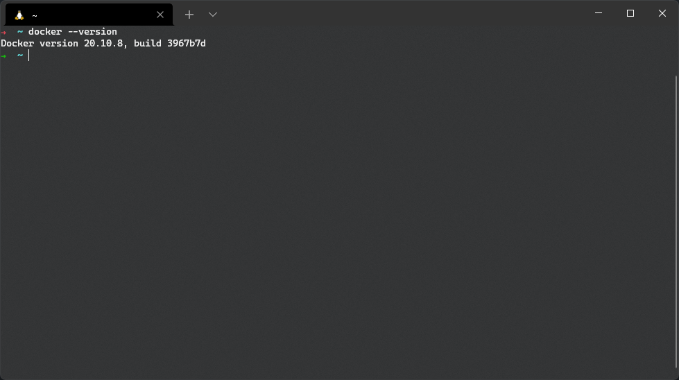
## Basic commands
You are probably wondering what are the basic commands you will use every day, here is a short cheat-sheet where you will find the most frequently used commands and their descriptions:

- The command `docker ps` shows all running containers
    ```
    $ docker ps
    ```
    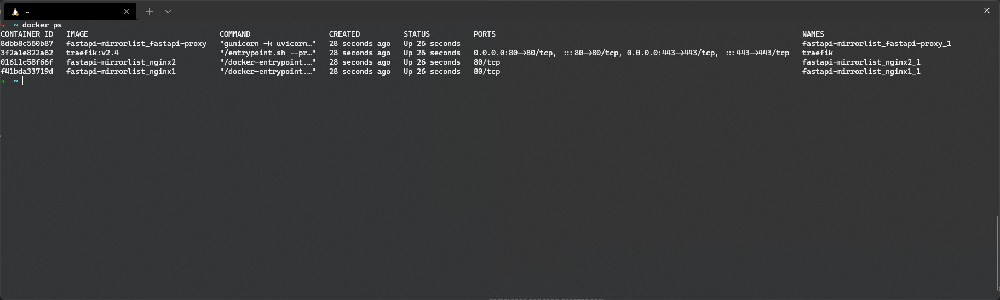

- The `docker images` command shows all downloaded containers
    ```
    $ docker images
    ```
    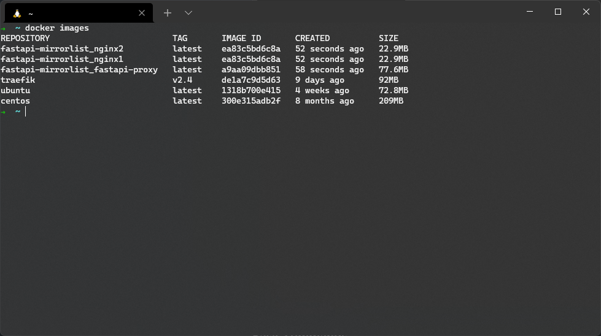

- The `docker pull` command allows you to download a container
    ```
    $ docker pull <container>
    ```
    

- The command `docker run` allows you to run the container 
    ```
    $ docker run <container>
    ```
    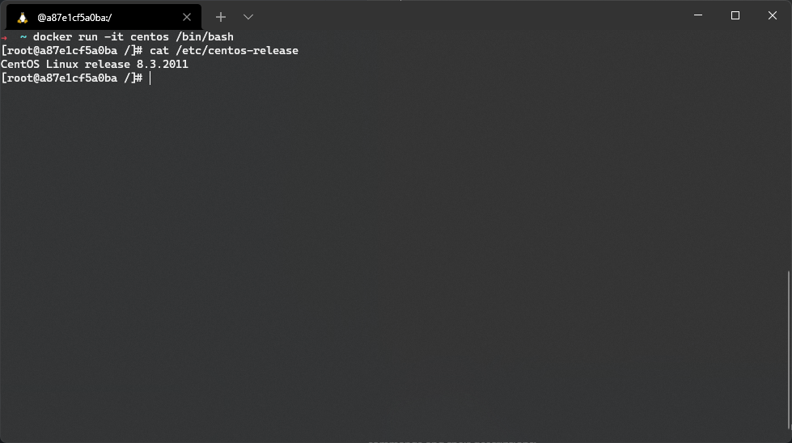

- The command `docker exec` allows you to execute the command / enter a running container
    ```
    $ docker exec
    ```
    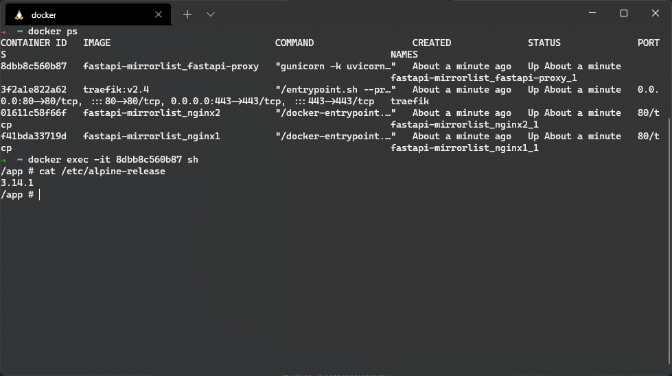

- The command `docker stop`, `docker kill` allows you to stop/kill a running container
    ```
    $ docker stop / $ docker kill
    ```
    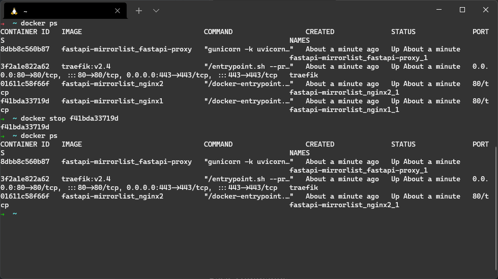

Of course, there are many more commands and their combinations and parameters that cannot be described in one simple tutorial, to satisfy your curiosity check out the Docker documentation full of different examples ▶ [Docker command line](https://docs.docker.com/engine/reference/commandline/cli/)    <br><br>


As a last example, let's run the nginx container and set its internal port "80" to port "2137" on our host, to do that we need to do the following: 

- Download the nginx container (alpine flavour because why not?):
    ```
    $ docker pull nginx:1.21-alpine
    ```
    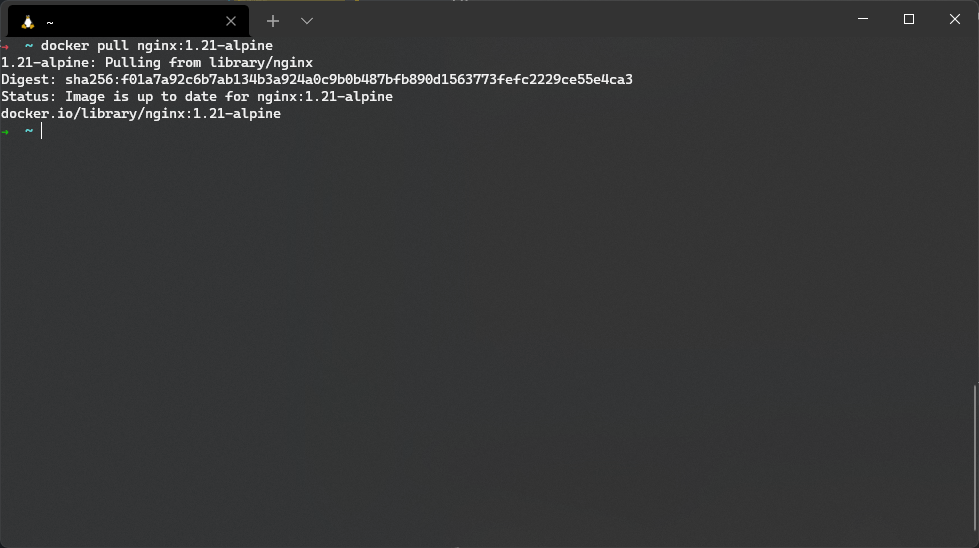

- Run the container in detach mode (to run in the background) and expose port 80 to port 2137:
    ```
    $ docker run -p 2137:80 -d nginx:1.21-alpine
    ```
    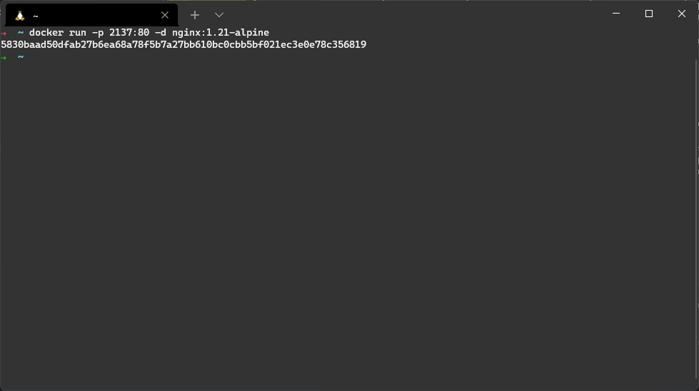

- Let's check if the container is working properly
    ```
    $ docker ps
    ```
    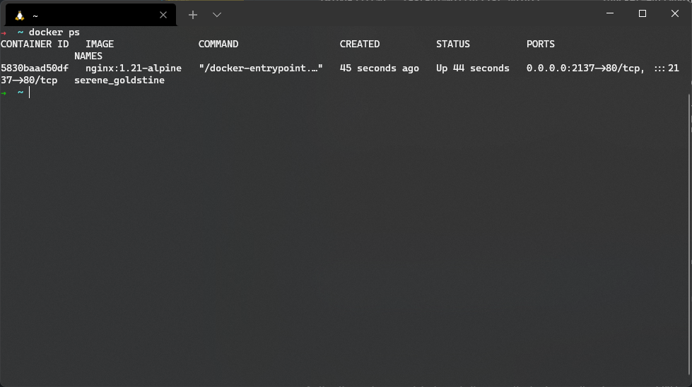


- Let's check if nginx is available via our port from the browser
    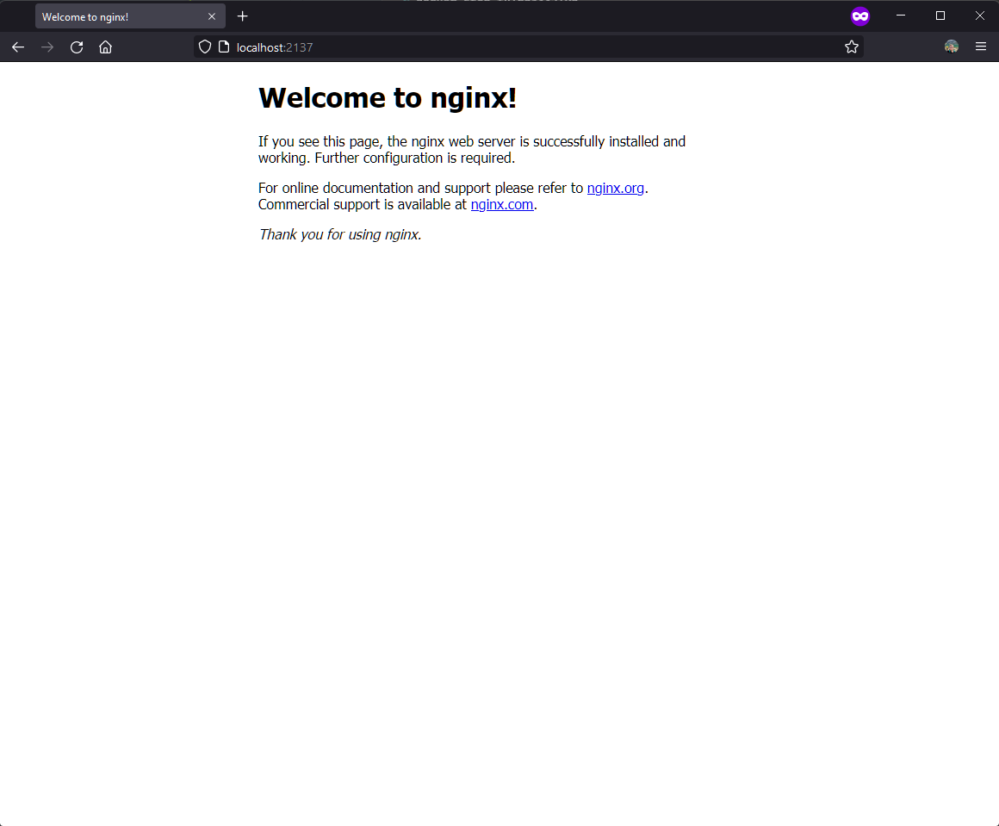


- ... and let's check the container logs
    ```
    $ docker logs <container id>
    ```
    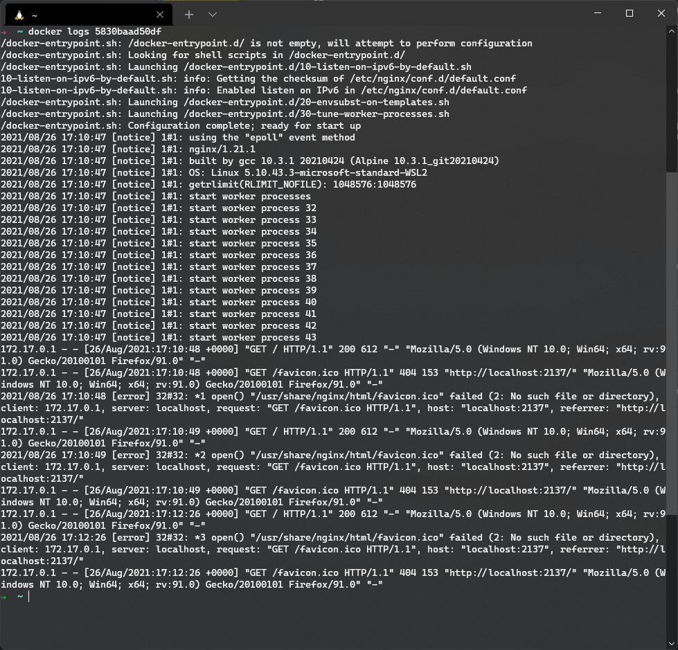

## How to build your first container?
We already know how to download and use ready-made containers, but what if we want to build our own? The `docker build` command comes in handy.

Let's move on to the example located in the `build-example` directory in the repository. It is a very simple application written in python with the use of FastAPI framework which when launched by entering '/' endpoint shows a simple message and hostname.  <br><br>
Getting back to the point, we want to build a container that will serve this great application, to do this we need to prepare a file called "`Dockerfile`". This file defines the steps that Docker will perform to build the target container, information on what container is to be based on, what packages must be installed to run our application, what files to copy inside etc... . 
Let's take a look at our file. 
```dockerfile
FROM python:3.9-alpine as build

ENV PYTHONDONTWRITEBYTECODE 1
ENV PYTHONUNBUFFERED 1

RUN apk --no-cache add build-base

RUN pip install pip setuptools --upgrade && \
    pip install fastapi uvicorn[standard]

FROM python:3.9-alpine as publish

ENV PYTHONDONTWRITEBYTECODE 1
ENV PYTHONUNBUFFERED 1

WORKDIR /app

COPY --from=build /usr/local/lib/python3.9/site-packages/ /usr/local/lib/python3.9/site-packages/
COPY --from=build /usr/local/bin/ /usr/local/bin/

COPY main.py /app/main.py

ENTRYPOINT [ "uvicorn", "main:app", "--reload", "--host", "0.0.0.0" ]
```
At first glance, it may seem quite complicated, but let's break it down into individual sections, build and publish section:

- Build section is responsible for "building" our application and installing dependencies, in this case it is based on the Python 3.9 version based on the alpine distribution using the 'FROM' command, the next step, because it is a python container, we set some variables that allow us to optimize the build and run process application - 'ENV' command. Another 'RUN' command allows you to run commands that are executed in our container, the first in the example installs dependencies using the apk package manager, the next installs python dependencies using the pip manager.
    ```dockerfile
    FROM python:3.9-alpine as build

    ENV PYTHONDONTWRITEBYTECODE 1
    ENV PYTHONUNBUFFERED 1

    RUN apk --no-cache add build-base

    RUN pip install pip setuptools --upgrade && \
        pip install fastapi uvicorn[standard]
    ```

- Publish section in this case is responsible for preparing the container for publishing the application, the container is still based on the same python version and we set the same environment variables but then we use the 'COPY' command. This command allows you to copy files between the host and the container, between different stages of the container. The first use of this command copies the previously built python dependencies needed to run the application from the 'build' section to our container, the next one copies the 'main.py' file from the host to our container. The last command in the 'ENTRYPOINT' file is responsible for setting the command that will be used when starting the container.
    ```dockerfile
    FROM python:3.9-alpine as publish

    ENV PYTHONDONTWRITEBYTECODE 1
    ENV PYTHONUNBUFFERED 1

    WORKDIR /app

    COPY --from=build /usr/local/lib/python3.9/site-packages/ /usr/local/lib/python3.9/site-packages/
    COPY --from=build /usr/local/bin/ /usr/local/bin/

    COPY main.py /app/main.py

    ENTRYPOINT [ "uvicorn", "main:app", "--reload", "--host", "0.0.0.0" ]
    ```

Of course, there are many more different commands that can be used when creating a Dockerfile, in the documentation you'll find all the available commands ▶ [Dockerfile docs](https://docs.docker.com/engine/reference/builder/)

To build a container and see the fruit of our work, we need to execute the following command from the Dockerfile directory and the application (the process may take some time):
```
$ docker build -t build-example .
```
The `-t` parameter allows us to name our container, the dot at the end means the context from which the container is built.

Then let's run our container and check if everything is working properly:
```
$ docker run -p 8000:8000 build-example
```
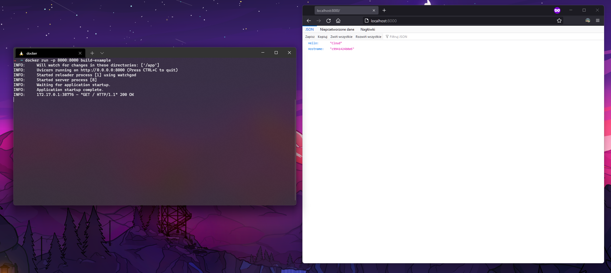

Let's move on to the next example, write a simple dockerfile that will allow us to build a container with ansible and molecule inside (ps. you won't find it inside the repository):
```dockerfile
# let's use debian this time
FROM python:3.9-buster

# first, let's update our container and install the necessary dependencies
RUN apt-get update && \
    apt-get dist-upgrade -y && \
    apt-get install libssl-dev -y && \
    rm -rf /var/lib/apt/lists/*

# let's update pip and setuptools as well
RUN pip install --no-cache-dir pip setuptools --upgrade

# and finally install our packages: ansible and molecule
RUN pip install --no-cache-dir ansible && \
    pip install --no-cache-dir molecule[ansible,lint]
```
Let's save the file as Dockerfile and build our container with the command:
```
$ docker build -t ansible_container .
```

Finally, let's start our container and check if everything went ok:
```
$ docker run -it ansible_container bash
```
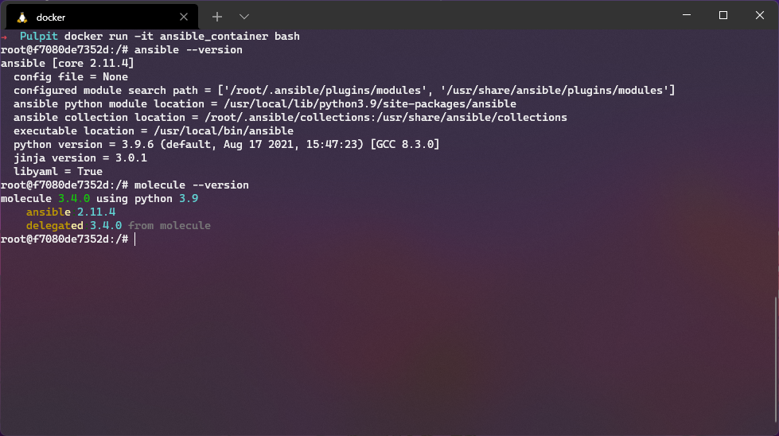

As you can see, building different containers is not difficult and you can use it for various purposes, the most important thing is practice, you can build a container with your web application or just build it and run it because you need to use another application that is not available on your system, surely you can come up with other reasons yourself 😉
## Multi-container Docker applications
What if we have a group of containers that we want to run? To facilitate the entire process, we can use the docker-compose tool.  

When installing the docker-desktop application on Windows and Mac, the docker-compose plugin should install itself, in the case of GNU / Linux systems it should be installed by yourself ▶ [Install docker-compose](https://docs.docker.com/compose/install/).  

Docker-compose configuration files are saved in the yml / yaml format. Let's try to write it for the previously presented python application:
```yml
version: "3.9"
services:
    build-example:
        build:
            dockerfile: Dockerfile
            context: .
        ports:
            - "8000:8000"
        container_name: "build-example"
        restart: unless-stopped
```

At the very beginning, the docker-compose file takes the version value, it is a predefined value that corresponds to a given version of the tool we want to use, then there is a service definition. It contains our containers that we want to run, here we define a website called "build-example", a container for it will be built from a local Dockerfile file, we issue port 8000 from the container to port 8000 on the host, we name our container and set it to restart policy. Then we need to execute the following commands to run our application:

- Build an application
    ```
    $ docker-compose build
    ```
    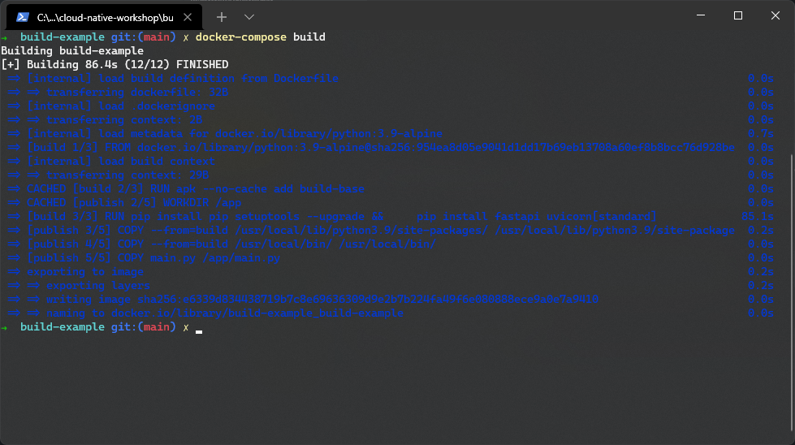
- Run the docker-compose file:
    ```
    $ docker-compose up
    ```
  ... or run the app in detech mode: 
    ```
    $ docker-compose up -d
    ```
    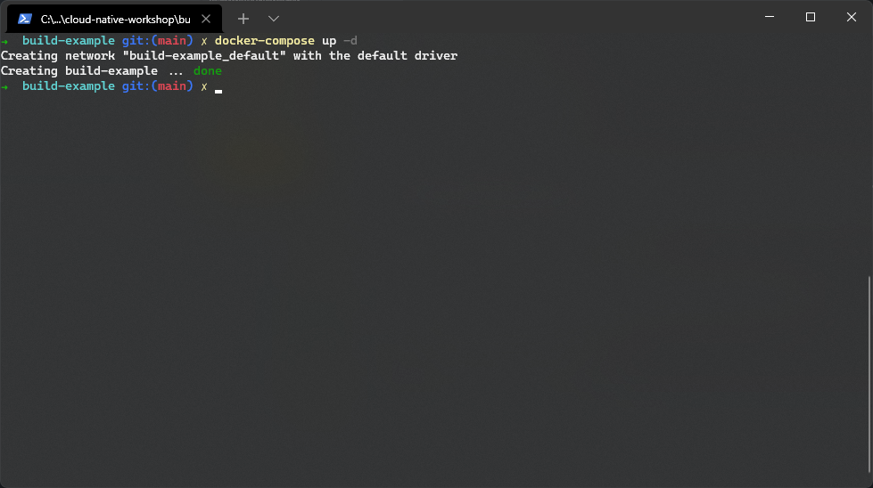
- At the end, we can check the logs of our application:
    ```
    $ docker-compose logs --follow
    ```
    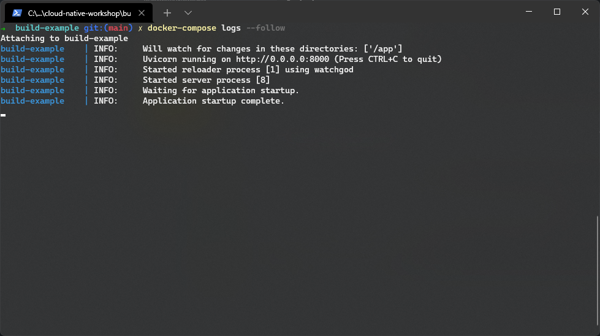

Let's move on to a more complicated example that can be found in the compose-example folder on this repository. There is a simple application written in golang that requires a PostgreSQL database to work, in addition, we will use the Traefik edge router to move and display the application. We also want the application itself to be run in 3 replicas to ensure application redundancy/HA.
## Additional tooltips and practices that do not match the rest of the guide

- How to stop all running containers?
    ```
    $ docker stop $(docker ps -a -q)
    ```

- How to remove all stopped containers/networks/images and build cache?
    ```
    $ docker system prune --all
    ```