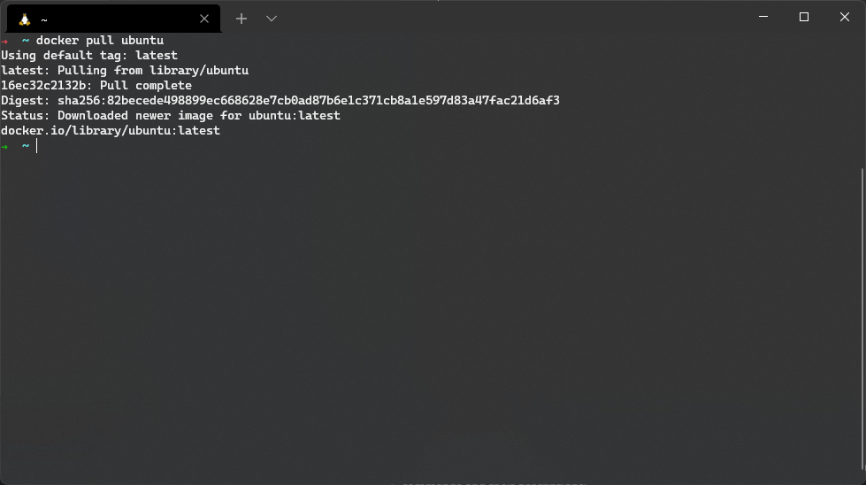

# Cloud Native Workshop
## Table of contents
1. [Introduction](#introduction)
2. [Installation](#installation)
3. [Basic commands](#basic-commands)
4. [How to build your first container](#how-to-build-your-first-container)
5. [Multi-container Docker applications](#multi-container-docker-applications)

## Introduction

Welcome to the first Cloud Native Workshop labs!  
You will learn the basic docker commands, how to prepare, build and run your first container and how to use docker-compose to run a group of containers.

## Installation  

Depending on what system you use, the docker installation may be different, the easiest way is to always follow the instructions provided in the Docker documentation:
- [Windows](https://docs.docker.com/desktop/windows/install/)
- [Mac](https://docs.docker.com/desktop/mac/install/)
- GNU/Linux:
    - [Debian](https://docs.docker.com/engine/install/ubuntu/)
    - [Ubuntu](https://docs.docker.com/engine/install/debian/)
    - [Centos](https://docs.docker.com/engine/install/centos/)
    - [Fedora](https://docs.docker.com/engine/install/fedora/)

If you have a GNU/Linux system, you can also consider performing additional optional configuration thanks to which, among other things, you will be able to execute commands without the need to elevate privileges ▶ [Post-installation steps for Linux](https://docs.docker.com/engine/install/linux-postinstall/)

After installing and launching the Docker application, let's run our first command to check the Docker version:
```
$ docker --version
```

## Basic commands
You are probably wondering what are the basic commands you will use every day, here is a short cheat-sheet where you will find the most frequently used commands and their descriptions:

- The command `docker ps` shows all running containers
    ```
    $ docker ps
    ```
    

- The `docker images` command shows all downloaded containers
    ```
    $ docker images
    ```
    

- The `docker pull` command allows you to download a container
    ```
    $ docker pull <container>
    ```
    

- The command `docker run` allows you to run the container 
    ```
    $ docker run <container>
    ```
    

- The command `docker exec` allows you to execute the command / enter a running container
    ```
    $ docker exec
    ```
    

- The command `docker stop`, `docker kill` allows you to stop/kill a running container
    ```
    $ docker stop / $ docker kill
    ```
    

Of course, there are many more commands and their combinations and parameters that cannot be described in one simple tutorial, to satisfy your curiosity check out the Docker documentation full of different examples ▶ [Docker command line](https://docs.docker.com/engine/reference/commandline/cli/)    <br><br>


As a last example, let's run the nginx container and set its internal port "80" to port "2137" on our host, to do that we need to do the following: 

- Download the nginx container (alpine flavour because why not?):
    ```
    $ docker pull nginx:1.21-alpine
    ```
    

- Run the container in detach mode (to run in the background) and expose port 80 to port 2137:
    ```
    $ docker run -p 2137:80 -d nginx:1.21-alpine
    ```
    

- Let's check if the container is working properly
    ```
    $ docker ps
    ```
    


- Let's check if nginx is available via our port from the browser
    


- ... and let's check the container logs
    ```
    $ docker logs <container id>
    ```
    

## How to build your first container?


## Multi-container Docker applications